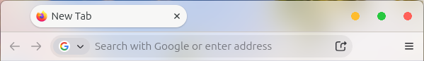
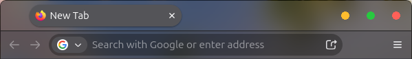

[](README.md) [](README.ko.md)

# Aurora Theme for Firefox

A macOS-inspired CSS theme for Firefox on Linux, with light and dark styles.

**0.2.2-beta.1 · Beta.** Tested on Firefox 157 Snap with GNOME 46 / Wayland. Firefox internal UI CSS can change between releases; compatibility after every update is not guaranteed. This is an independent, unofficial project, unaffiliated with Mozilla or Apple.

**Light**



**Dark**



*User-provided screenshots, cropped to the tab and address bars.*

## Features

- Light/dark colors and colored window buttons, while keeping Firefox's native click areas, button order and commands.
- The green button maximizes/restores on Linux. Placement follows the desktop's existing layout.
- Modular CSS and four small SVG glyphs; no external fonts or runtime downloads.
- Guided setup, one explicit profile, a preview before applying, and original-theme backups.
- Optional translucent toolbar surfaces. Actual background blur requires a separately configured compositor.

## Quick start

Requires **Linux, Bash and Python 3.10+** with its standard library. No root access or WhiteSur installation is required. Dependencies are not installed automatically. The current guided installer uses Korean prompts; explicit commands below work without the interactive menu.

```bash
git clone https://github.com/GYJeong-AI/aurora-firefox-theme.git
cd aurora-firefox-theme
bash install.sh
```

Choose an action, a distribution search scope, one profile and a mode; review the changes and type `APPLY`. Find your profile's absolute path in Firefox's `about:support`. Save your work and close Firefox normally before applying; restart it yourself afterward. Try a separate test profile first, especially if you already use custom CSS.

Explicit commands default to preview. Replace the example path with your own:

```bash
bash install.sh --list-profiles
bash install.sh install --profile "/absolute/path/to/profile" --mode opaque
bash install.sh install --profile "/absolute/path/to/profile" --mode opaque --apply
bash install.sh status --profile "/absolute/path/to/profile"
```

Installation preserves the original `chrome` directory or link and adds a managed block in `user.js` for `toolkit.legacyUserProfileCustomizations.stylesheets`. A private `prefs.js` recovery snapshot is saved, but that file is not modified. History, cookies, logins and sessions are not copied. Keep profile backups private.

## Update, remove and recover

Get the new source, then update the same profile with an explicit mode:

```bash
git pull --ff-only
bash install.sh update --profile "/absolute/path/to/profile" --mode opaque --apply
```

Unexpected edits or extra files in the managed theme cause the installer to stop. Preserve your edits before resolving the conflict. Removal restores the original theme and removes only Aurora's managed `user.js` block:

```bash
bash install.sh uninstall --profile "/absolute/path/to/profile"
bash install.sh uninstall --profile "/absolute/path/to/profile" --apply
```

Firefox may retain the CSS preference in `prefs.js` after removal. If needed, restore **that single preference** to its prior value in `about:config`; do not overwrite your current `prefs.js` with an old snapshot. Interrupted operations retain recovery records. Follow [recovery instructions](docs/RECOVERY.md), and preserve originals before any manual repair.

## Experimental glass and blur

```bash
bash install.sh update --profile "/absolute/path/to/profile" --mode glass --apply
```

Glass makes the tab and navigation surfaces translucent while keeping web content opaque. CSS alone does not blur the desktop. The optional GNOME helper accepts new applications only on **GNOME 46, Wayland, and an already active Blur my Shell 72**. It needs the existing GNOME command-line tools, a private backup and directly verified Firefox window classes. It keeps whole-window opacity at 255 and refuses to replace a blur scope containing other apps. See [blur setup and restoration](docs/BLUR.md).

Renderer alpha and UI behavior were checked; actual spatial desktop blur, compositor popup/maximize artifacts and controlled GPU/frame-time costs remain unverified. Glass and the GNOME helper are experimental. Return to `--mode opaque` and separately restore your compositor backup if problems occur.

## Support and validation

| Component | Checked scope |
| --- | --- |
| Firefox UI | Firefox 157.0 Snap, Ubuntu 24.04.5, GNOME 46 / Mutter 46.2, Wayland, built-in Light/Dark themes |
| Profile discovery | Native, Snap and Flatpak registration locations; this does not establish UI compatibility for each package |
| Installer | Temporary Linux profiles, directory/relative/absolute links, updates, removal, conflicts, interruption and rollback |
| GNOME helper | GNOME 46 / Blur my Shell 72 / Wayland; settings guards and mocked failure tests |

ESR, other Firefox releases, deb/Flatpak UI, X11, other desktops and extension versions are unverified. Separate OS titlebars may hide the internally styled buttons. Actual accessibility, mixed-monitor scaling and full compositor performance are not yet validated. [Validation and update checklist](docs/VALIDATION.md) · [Release limitations](docs/VALIDATION.md#release-status).

## Development and contributing

```bash
python3 -m unittest discover -s tests -v
bash -n install.sh
python3 tools/build.py --source
python3 tools/build.py
```

The suite contains 80 tests. The builder exports an uncompressed public source tree or a deterministic ZIP from an explicit allowlist. It refuses to overwrite an edited source export. Update `PUBLIC_FILES` and `.gitignore` together when adding a public file.

Issues and pull requests are welcome. Include Firefox/package version, desktop/compositor, theme mode, relevant steps and a redacted error. Do not attach profiles, backups, browsing data or private logs. Keep changes small and run the tests. [Installation details](docs/INSTALLATION.md) · [Engineering checks](docs/VALIDATION.md#installer-safeguards).

## License

Project code is under the [MIT License](LICENSE). Firefox, GNOME and other product names and their UI belong to their respective owners. The preview illustrates browser compatibility; this project does not claim ownership of third-party UI.
